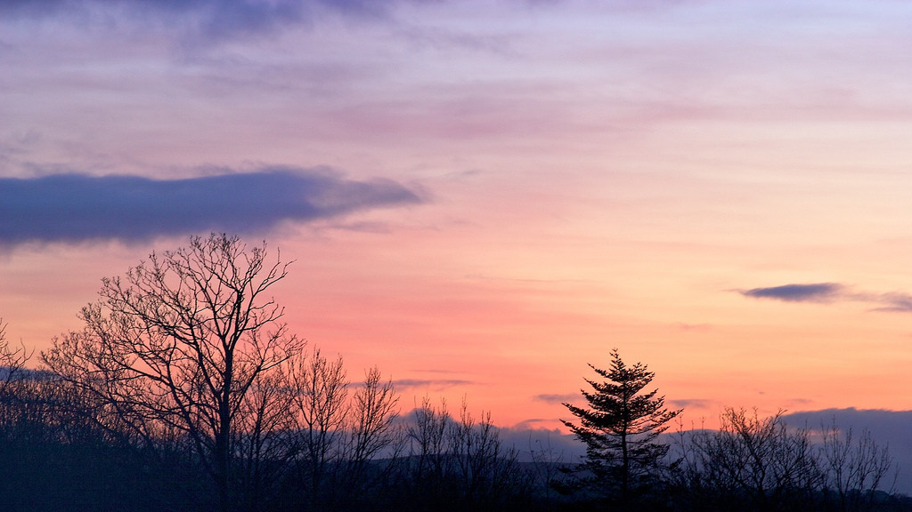

# night-and-day

A Vim plugin to automatically switch between a 'day theme' and 'night theme'.

In order to use this plugin, **two dependencies must be installed**:

- [vim-colorscheme-switcher](https://github.com/xolox/vim-colorscheme-switcher)
- [vim-misc](https://github.com/xolox/vim-misc)

## how it works

Some folks like to flip between a light theme during the day and a dark theme at night. When Vim is launched, night-and-day checks the time and loads the appropriate theme. It then runs in the background, ready to switch the theme if Vim happens to be running as night falls, or as morning breaks.

## installation

Vim plugins can be managed with [Vundle](https://github.com/VundleVim/Vundle.vim), which can be installed by running the following command in a terminal:

~~~
git clone https://github.com/VundleVim/Vundle.vim.git ~/.vim/bundle/Vundle.vim
~~~

Next, add the following to the top of `vimrc`:

~~~
set nocompatible
filetype off
set rtp+=~/.vim/bundle/Vundle.vim
call vundle#begin()
Plugin 'VundleVim/Vundle.vim'
Plugin 'nightsense/night-and-day'
Plugin 'xolox/vim-colorscheme-switcher'
Plugin 'xolox/vim-misc'
call vundle#end()
filetype plugin indent on
~~~

Then, within Vim, run `VundleUpdate`.

## configuration

Configuring night-and-day involves setting variables in `vimrc`.

Day and night **themes** are set with `g:nd_day_theme` and `g:nd_night_theme`. For instance, to set the day theme to [seagull](https://github.com/nightsense/seabird) and night theme to petrel:

~~~
let g:nd_day_theme = 'seagull'
let g:nd_night_theme = 'petrel'
~~~

The **thresholds** of day and night are set with `g:nd_dawn_time` and `g:nd_dusk_time`. Both variables accept an integer value from 0 to 23, representing hours on the 24-hour clock (0 is midnight, 23 is 11 PM). For instance, to have the day theme activate at 8AM and night theme activate at 8PM (the default values):

~~~
let g:nd_dawn_time = 8
let g:nd_dusk_time = 20
~~~

By default, Vim applies `background=light` to colour schemes. In order to assign **`background=dark`**, use `nd_day_bgdark` and/or `nd_night_bgdark`, like so:

~~~
let g:nd_day_bgdark    = 0
let g:nd_night_bgdark  = 1
~~~

(0 means false, 1 means true; both are false by default.)

Example setup: switch to [solarized](https://github.com/altercation/vim-colors-solarized) light at 7AM, solarized dark at 8PM:

~~~
let g:nd_day_theme   = 'solarized'
let g:nd_night_theme = 'solarized'
let g:nd_dawn_time = 7
let g:nd_night_bgdark = 1
~~~

## notes

Photo by [Neil Tackaberry](https://www.flickr.com/photos/23629083@N03/6904426431), licensed [CC BY-ND 2.0](https://creativecommons.org/licenses/by-nd/2.0/).
