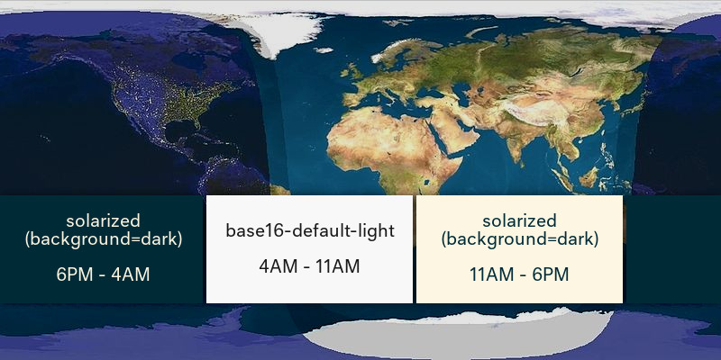

# night-and-day

A **vim theme scheduler**. Divide your day into as many intervals as you like, assigning each interval it's own theme.



## installation

If you don't have a preferred approach to **plugin management**, consider trying [vim-plug](https://github.com/junegunn/vim-plug), which can be installed with:

~~~
curl -fLo ~/.vim/autoload/plug.vim --create-dirs \
    https://raw.githubusercontent.com/junegunn/vim-plug/master/plug.vim
~~~

To **install night-and-day** via vim-plug, add the following to the top of your `vimrc`:

~~~
call plug#begin('~/.vim/plugged')
Plug 'nightsense/night-and-day'
call plug#end()
~~~

Then, within vim, run `PlugUpdate`.

## configuration

You'll need to add **three lines of configuration**to `vimrc`. Like so:

```
let g:nd_themename = ["base16-default-light", "solarized", "solarized"]
let g:nd_themetime = ["4:00", "11:00", "18:00"]
let g:nd_themeback = ["light", "light", "dark"]
```

setting        | description
:-------------:|:----------:
g:nd_themename | the **name** of each theme (as used by the vim command `colorscheme`)
g:nd_themetime | the **starting time** for each theme (in `H:MM`/`HH:MM` format)
g:nd_themeback | the **background state** for each theme (either `light` or `dark`)

> `light` is the default background state in vim, and is expected by many themes that don't feature background toggling.

So for each theme interval you want to define, you'll need one entry on each line. Be sure they align, and arrange them in chronological order (starting from midnight).

The above sample configuration, which reflects the world map image at the top of this readme, will activate:

- `base16-default-light` 4-11AM
- `solarized` (light background) 11AM-6PM
- `solarized` (dark background) 6PM-4AM

## notes

This plugin incorporates the [vim-colorscheme-switcher](https://github.com/xolox/vim-colorscheme-switcher) by xolox.

Photo by [Neil Tackaberry](https://www.flickr.com/photos/23629083@N03/6904426431), licensed [CC BY-ND 2.0](https://creativecommons.org/licenses/by-nd/2.0/).

Map courtesy of [Wikimedia Commons](https://commons.wikimedia.org/wiki/File:Daylight_Map,_nonscientific_(0900_UTC).jpg).
